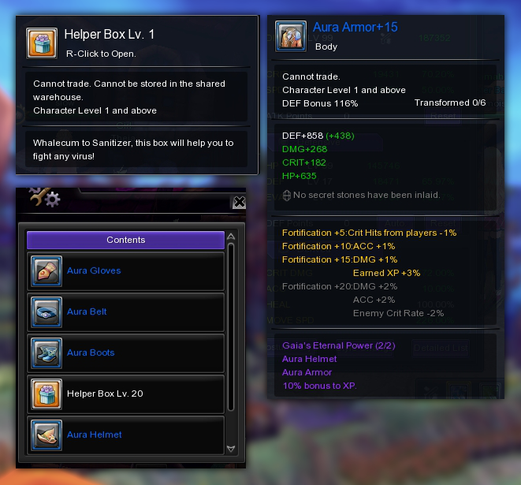
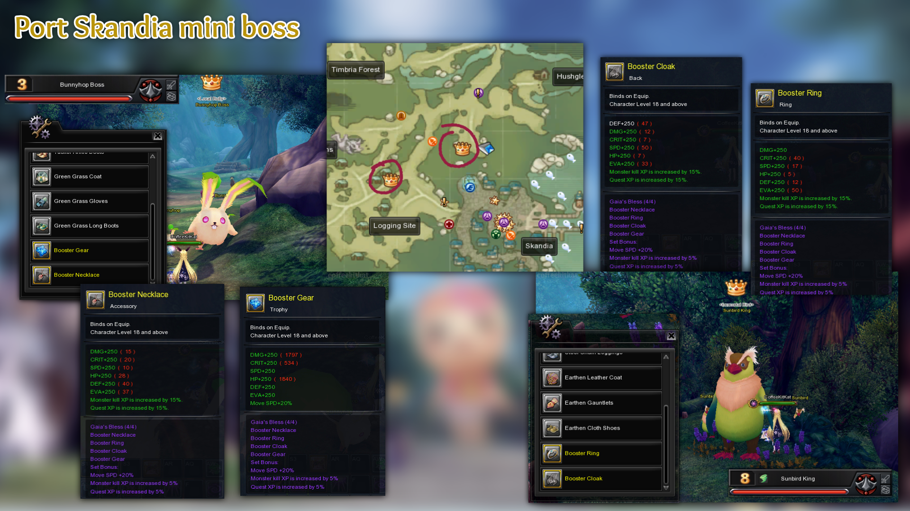
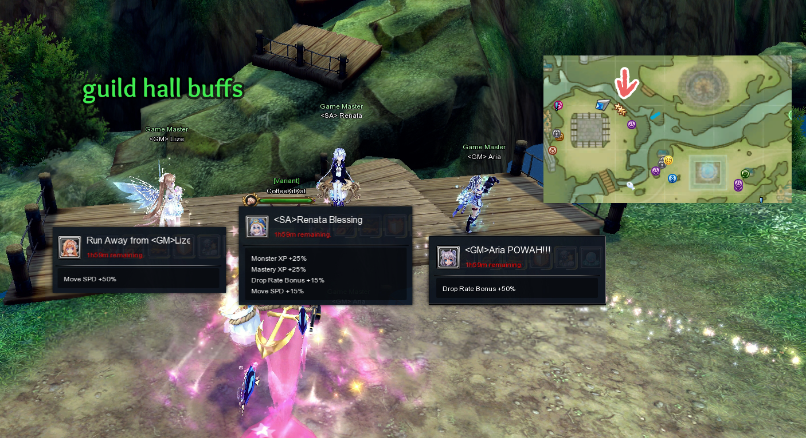
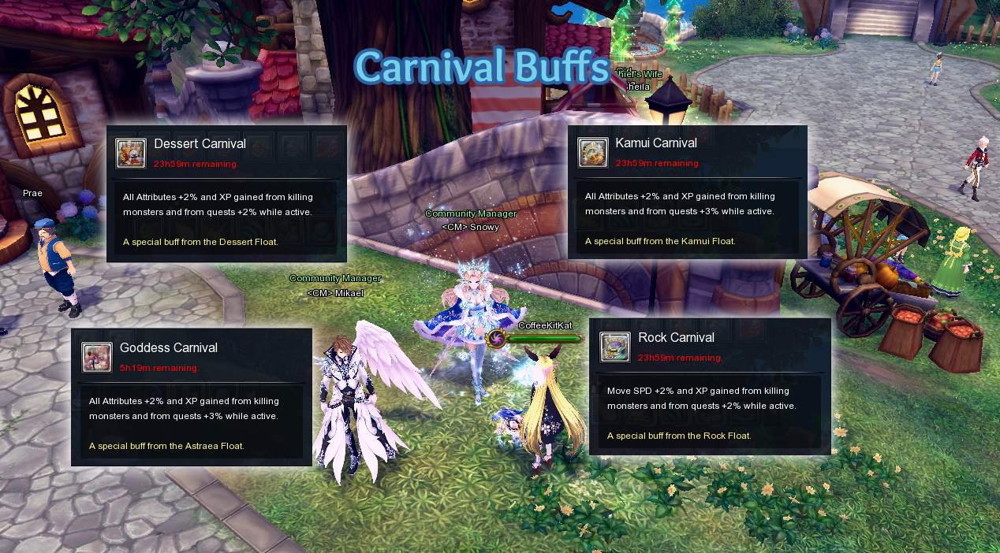

# Untitled (2)

**Leveling Guide**

**Maximizing/Boosting EXP:**

Take all **Port Skandia Buffs** and use EXP Cards, 24 Hour Exp Crystal, 7 Day Exp Crystal, Guardian Sprite of Gaia (3 Days) and World Piece VIP Guardian.

**Aura Set**
This is obtained from the "Helper Box Lv.1"
Aura set gives +20% EXP and when fortified upto +15 it gives a total of +35% EXP.

**Booster Set**

Booster Set is a custom accessory that drops from Bunnyhop Boss and Sunbird King on Port Skandia. You can use any quality of Treasure Charms on the two mini boss on Port Skandia.

**Envoy Path**
Take the EXP tiles on your Envoy.

**Guild Hall GM Buff**
There are 3 NPC on the Guild hall that gives GM buffs

**Carnival Buffs**

Talk to NPC Snowy and NPC Mikael to obtain the Carnial Buffs

